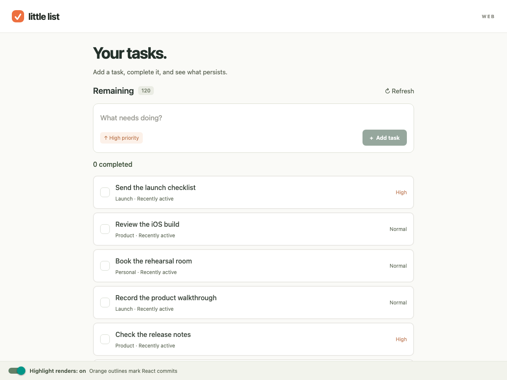

# Debug CLI Challenge — example CLI

**Ask your coding agent to build a tool that lets it see your running app.**

Little List is a deliberately broken Expo todo app for web and iOS, backed by
Node and local SQLite. This branch supplies an example debug CLI; all three app bugs remain. Use
[main](https://github.com/okthink-ai/debug-cli-challenge/tree/main) to build your own tool.

## Start on web

You need **Node 22.13+** (24 LTS recommended), npm, and a browser. No accounts,
API keys, Docker, or separate database installation are needed.

```sh
git clone --branch solution https://github.com/okthink-ai/debug-cli-challenge.git
cd debug-cli-challenge
npm ci
npm run dev
```

Open **http://localhost:8087**. Complete **Send the launch checklist**, then
press **Refresh**. The app says it saved your change, but the task becomes
incomplete again. This is your first investigation.

## Give your agent this prompt

> Completing a task looks successful, but refreshing undoes it. Read the example
> debug CLI's help, connect to the running web app, and investigate before
> changing behavior. Start with one useful observation, then follow the request
> into the backend and SQLite. Make a repair and repeat the original action.
> Extend the tool if it cannot answer a question you need to investigate.

**CDP means Chrome DevTools Protocol.** It connects your tool to the running
JavaScript environment. It does not automatically expose application state;
your agent may add a small development bridge. Request IDs and raw server
records are already supplied. [The exercise guide](docs/exercise.md) explains
that scaffolding and how to grow the tool one observation at a time.

## Explore the example CLI

Keep the two starting points distinct:

| Branch | What is included |
| --- | --- |
| **`main`** | The app with three bugs. Build your own debug CLI here. |
| **[`solution`](https://github.com/okthink-ai/debug-cli-challenge/tree/solution)** | The same broken app with an example debug CLI. Explore how it works, then ask your agent to use it. |

**Both branches keep the app bugs.** `solution` is the tooling example.

To try it, stop the development server and commit any work before switching:

```sh
git switch solution
npm ci
npm run dev
```

In another terminal, open the debug browser and check the connection:

```sh
npm run debug -- browser
npm run debug -- doctor
npm run debug -- state
```

The [CLI guide on `solution`](https://github.com/okthink-ai/debug-cli-challenge/blob/solution/docs/debug-cli.md)
walks through the next commands. The browser launcher defaults to macOS Chrome;
[setup](docs/setup.md) covers other systems. Return with `git switch main` after
stopping the server and committing your work. Restart and reload your clients.

## Three things to investigate

1. **Across the stack:** a completed task becomes incomplete after refresh.
   Follow one action through client intent, the API response, and persisted data.
2. **Between platforms:** adding a task works on web but fails on iOS, although
   both composers show “High priority.” Compare the actual clients.
3. **React rendering:** typing a draft makes unchanged rows flash orange.
   Measure unnecessary commits first, then investigate their cost.

The **Highlight renders** switch controls those outlines. They indicate React
commits, not GPU repaints. The fixture includes 120 tasks and synthetic history.



## Continue when ready

Web is enough for the first and third exercises. The iOS extension requires a
Mac, Xcode, and Expo Go compatible with SDK 55. Follow [setup](docs/setup.md).

- **Reset:** `npm run reset`, then reload both clients. This resets sample data.
- **Verify repairs:** [acceptance checks](docs/acceptance.md), separate from the passing infrastructure tests.
- **Present or facilitate:** [demo flow](docs/demo-flow.md) and [newcomer session](docs/newcomer-session.md).

Created for Rafael Mendiola's okthink talk **Give Your Agents Perception**: give
agents repeatable access to product observations so they can investigate and
verify their own work. Fork the challenge and share your approach. MIT licensed.
